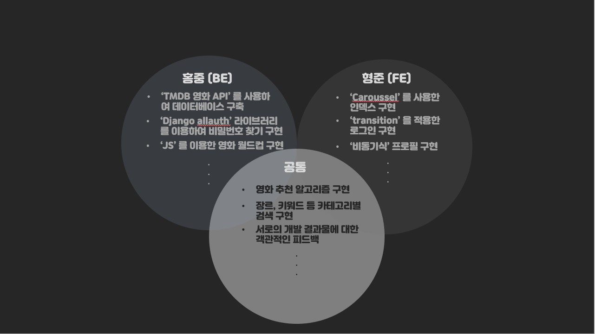
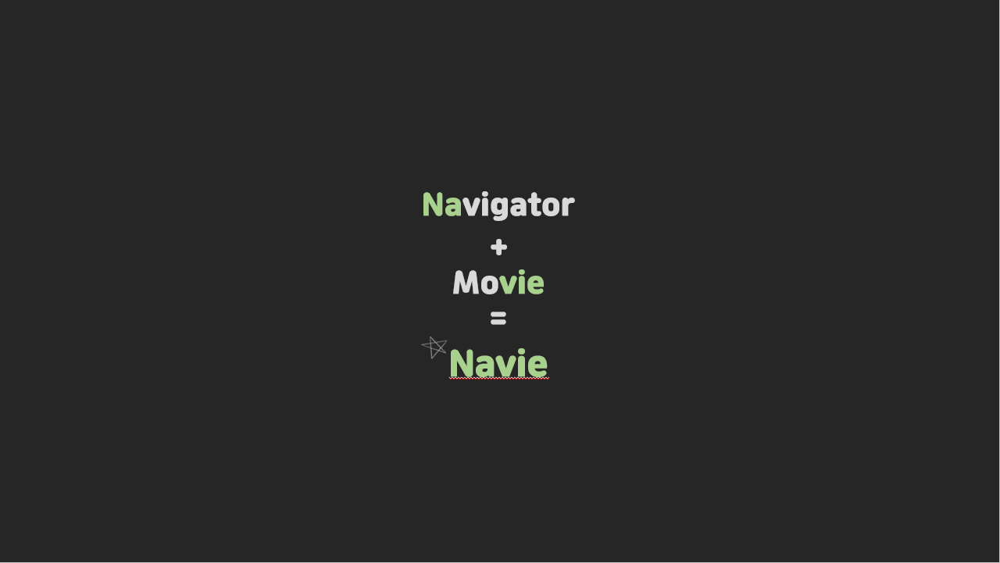
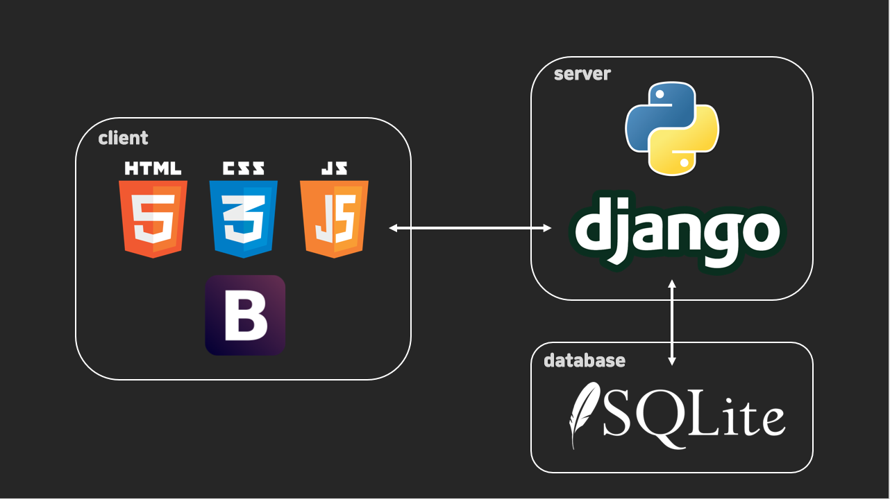
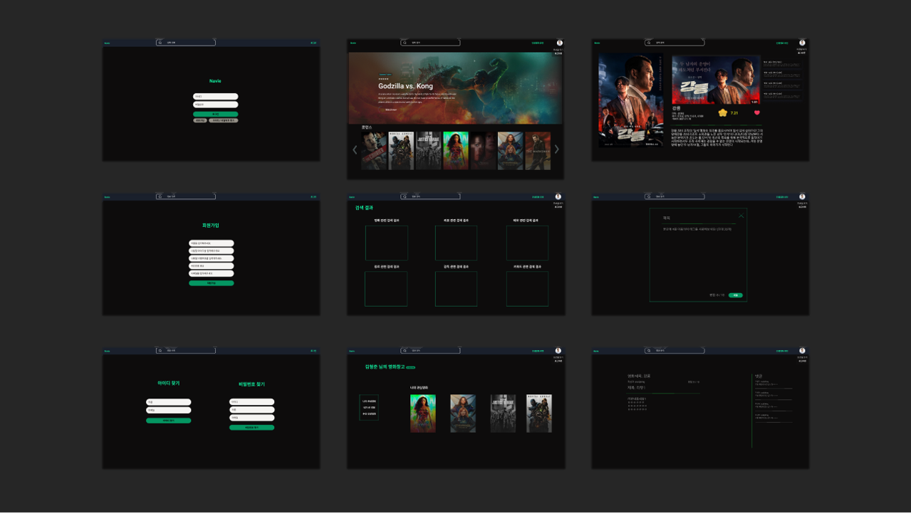
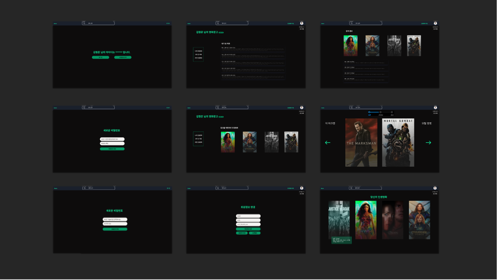
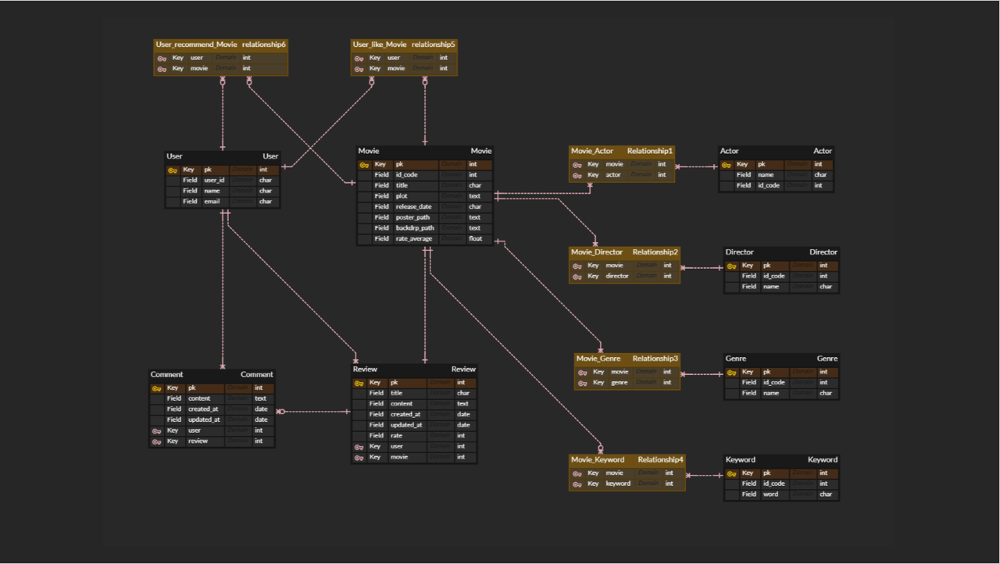

## 영화 커뮤니티 & 영화 추천 서비스 'Navie'

>당신의 인생영화를 찾아드립니다. 우리는 'Navie' 입니다.

 

### 목차

- [프로젝트 소개](#프로젝트-소개)
  - [기획의도](#기획의도)
  - [팀원](#팀원)
  - [주요 역할](#주요-역할)
  - [What is Navie?](#what-is-navie)
  - [개발 규칙](#개발-규칙)

- [프로젝트 디자인](#프로젝트-디자인)
  - [Tech Stack](#tech-stack)
  - [UI Design](#ui-design)
  - [ERD Design](#erd-design)
- [주요 기능](#주요-기능)
  - [주요 기능 목록](#주요-기능-목록)
  - [시연 및 설명](#시연-및-설명)

 

### 프로젝트 소개

### 기획의도

- 브레인 스토밍을 기반으로 한 기획회의를 통해 **'사용자의 인생영화를 찾아주는 영화 커뮤니티를 만들어 보자!'** 라는 기획의도를 도출하였습니다.

 

### 팀원

<table>
  <tr>
    <td align="center"><a href="https://github.com/hongjungkimm"> <b>HONGJUNG</b></a> </td>
    <td align="center"><a href="https://github.com/kimhyeongjun95"> <b>HYEONGJUN</b></a> </td>
  </tr>
</table>

 

### 주요 역할

- **HONGJUNG**: Back-End
- **HYEONGJUN**: Front-End

 

### What is Navie?

- **'Navie'** 는 **'Navigator**' 와 **'Movie'** 를 합친 서비스명으로써 사용자의 인생영화를 찾아주겠다는 의미를 내포하고 있습니다.

 

### 개발규칙

- 협업
  - 개발 일지를 꾸준하게 작성하여, 서로의 개발 현황을 공유합니다.
  - 이슈가 발생하면, 즉시 공유하여 함께 해결하기 위해 노력합니다.
  - Git Commit message 규칙을 지킵니다. ex) <날짜> <변경유형> [<변경사항>]
- 디자인
  - Look & Feel, 사용자가 보고 느끼는 것을 최우선으로 생각합니다.
  - 일관된 디자인 컨셉을 유지합니다.

 

### 프로젝트 디자인

### Tech Stack

 

### Ui Design

- 기존 영화 사이트들의 UI를 참고하였습니다.
- Figma의 Community에 있는 여러 템플릿을 재가공하여 제작하였습니다.

 

### ERD Design

- ERD cloud를 사용하여 제작하였습니다.
- 연계 테이블은 노란색으로 표시하였습니다.
- 기능 구현을 하는 중에 필요한 필드나 테이블을 추가하면서 지속적으로 수정하였습니다.

 

### 주요 기능

### 주요 기능 목록

### 시연 및 설명

